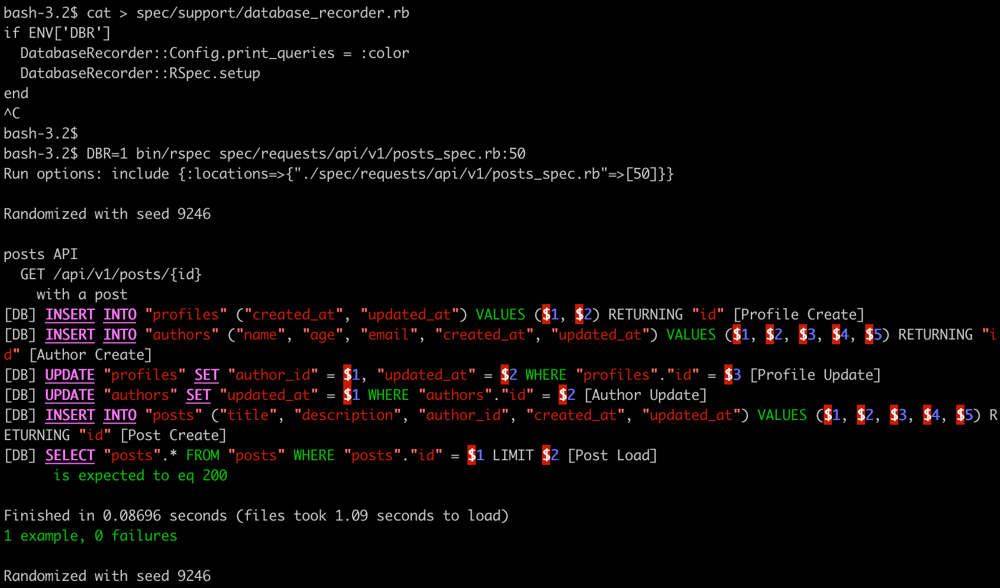

# Database Recorder
[](https://badge.fury.io/rb/database_recorder)
[](https://github.com/blocknotes/database_recorder/actions/workflows/linters.yml)
[](https://github.com/blocknotes/database_recorder/actions/workflows/specs_active_record.yml)
[](https://github.com/blocknotes/database_recorder/actions/workflows/specs_mysql.yml)
[](https://github.com/blocknotes/database_recorder/actions/workflows/specs_postgres.yml)

Record database queries for testing and development purposes.
Supports only RSpec at the moment. Store queries information on files or Redis.

Main features:
- store the history of the queries of a test when it run (for monitoring);
- eventually check if the current queries match the recorded ones (to prevent regressions);
- [EXPERIMENTAL] optionally replay the recorded queries replacing the original requests.

Sample output: [test.yml](extra/sample.yml)

## Install

- Add to your Gemfile: `gem 'database_recorder', require: false` (:development, :test groups recommended)
- Using RSpec, add in **rails_helper.rb**:

```rb
require 'database_recorder'
DatabaseRecorder::RSpec.setup
```

- In the tests add `:dbr` metadata, examples:

```rb
  # Activate DatabaseRecorder with the default options
  it 'returns 3 posts', :dbr do
    # ...
  end

  # Verify queries comparing with the stored ones:
  it 'returns more posts', dbr: { verify_queries: true } do
    # ...
  end
```

Or eventually apply the metadata per path:

```rb
RSpec.configure do |config|
  config.define_derived_metadata(file_path: %r{/spec/models/}) do |metadata|
    metadata[:dbr] = true
  end
end
```

Using an environment variable to enable it:



## Config

Add to your _spec_helper.rb_:

```rb
# Database driver to use: :active_record | :mysql2 | :pg
DatabaseRecorder::Config.db_driver = :pg

# Log queries format (default: '[DB] %sql [%name]')
DatabaseRecorder::Config.log_format = '>>> %name -- %sql'

# To print/log the queries while executing the specs: false | true | :color
DatabaseRecorder::Config.print_queries = true

# Replay the recordings intercepting the queries
DatabaseRecorder::Config.replay_recordings = true

# To store the queries: :file | :redis | nil
DatabaseRecorder::Config.storage = :redis
# nil to avoid storing the queries

# File storage options
DatabaseRecorder::Config.storage_options = { recordings_path: '/some/path' }

# Redis storage options
DatabaseRecorder::Config.storage_options = { connection: Redis.new }
```

## History of the queries

Using the `print_queries` config option is possible to see the executed queries while running the specs. It can be used to identify easily what is going on in a specific example without having to analyze the log files.

Using the `:file` storage, the history is also recorded to files (default path: **spec/dbr**) in YAML format. This is useful for checking what's happening with more details, it includes the query results and some extra data.

## Test queries' changes

This feature can be used to prevent queries regressions.
It requires to have previously stored the history of the queries (which could be versioned if using file storage).
It can be activated using `dbr: { verify_queries: true }` metadata.

To work correctly in requires `prepared_statements: true` option in the **database.yml** config file, in the connection block options (available for both Postgres and MySQL).

## Replay the recorded queries

This feature is not stable (at this stage), so use it carefully and supports only deterministic tests (so it doesn't work with Faker, random data or random order specs) and only Postgres is supported for now.
It requires to have previously stored the history of the queries.
Using this feature can improve the test suite performances (especially using redis storage).
It can be activated using `replay_recordings` config option.

Some workarounds to make it works:
- Run specs with `bin/rspec --order defined`
- Set a specific seed for Faker (optionally with an ENV var): `Faker::Config.random = Random.new(42)`
- Set a specific Ruby seed (optionally with an ENV var): `srand(42)`

## Do you like it? Star it!

If you use this component just star it. A developer is more motivated to improve a project when there is some interest.

Or consider offering me a coffee, it's a small thing but it is greatly appreciated: [about me](https://www.blocknot.es/about-me).

## Contributors

- [Mattia Roccoberton](https://blocknot.es): author

## License

The gem is available as open-source under the terms of the [MIT](MIT-LICENSE).
